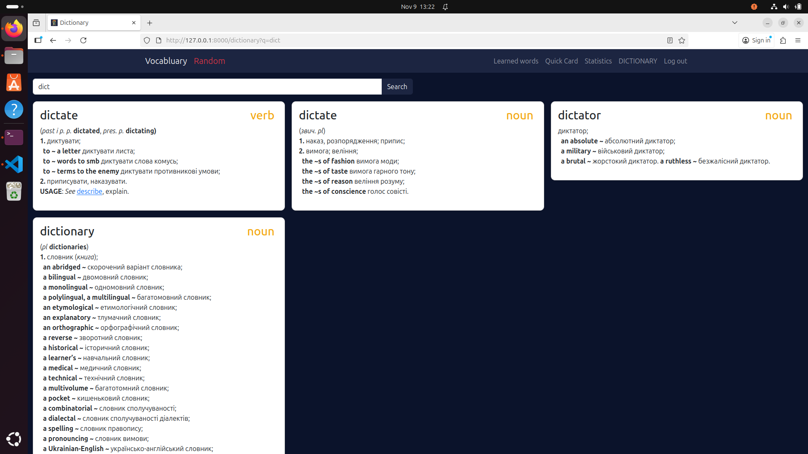
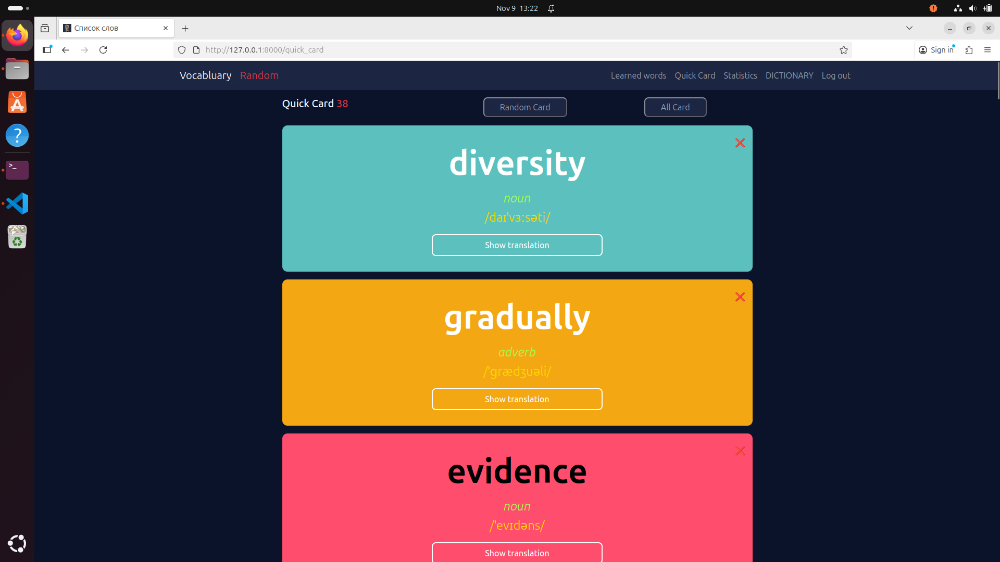
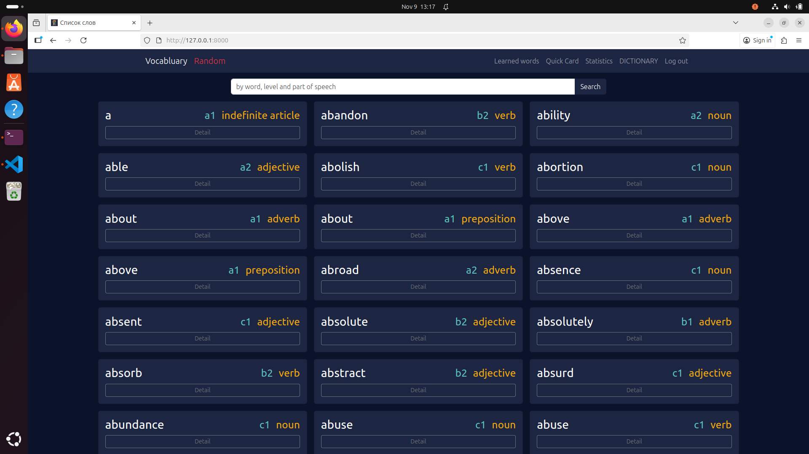
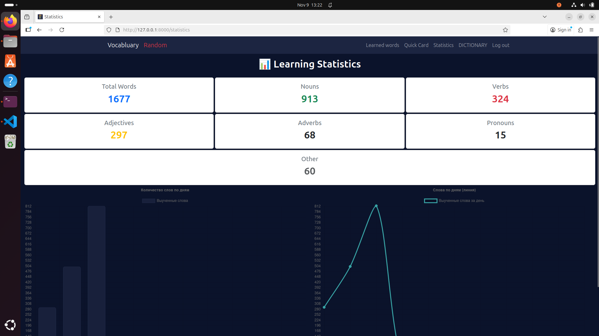
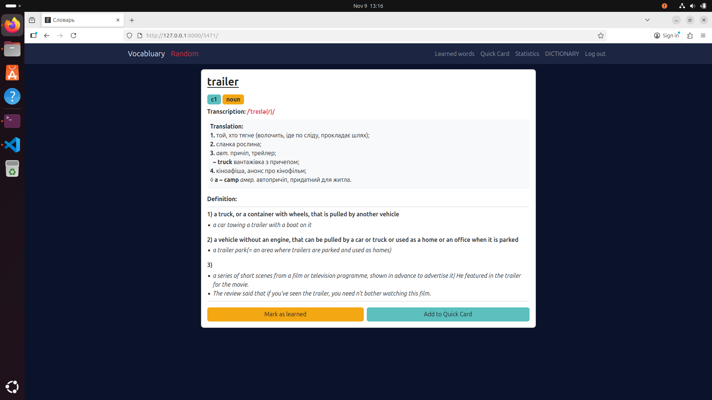
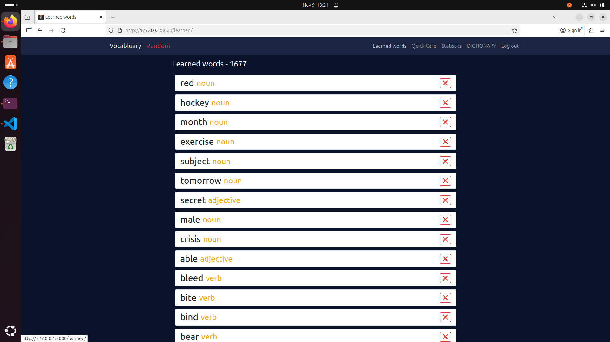

# English Learning App

An interactive web application for learning English, built with **Django**, **Python**, **HTML**, **CSS**, and **JavaScript**.  
The app helps users expand their vocabulary, track learning progress, and practice using flashcards.

---

##  Features

-  **Progress Statistics** — track your daily and total learning progress  
-  **Flashcards** — memorize words quickly and efficiently  
-  **Dictionary of 5000+ words** for conversational English  
-  **Learned Words List** — see what you’ve already mastered  
-  **Search and Filter** — find words easily  

---

## Screenshots

| Dictionary | Quickcards | Main page | 
|-------------|------------|-------------|
|  |  |  |

| Statistics | Word Detail | Learned List |
|-------------|------------|-------------|
|  |  |  |

>  Place real screenshots inside the `/readme_images` folder in your project directory.

---

## Tech Stack

- Python 3.12
- Django
- HTML5
- CSS3
- JavaScript

## Roadmap

 - 🔐 Add user authentication and profiles

 - 🔊 Add word pronunciation (audio feature)

 - 📝 Add quizzes and word tests

 - 📈 Improve statistics and visual analytics

##  Installation and Setup
```bash
# Clone the repository
git clone https://github.com/DaShy72/vocab.git

# Navigate to the project folder

# Install dependencies
pip install -r requirements.txt

# Run the server
python manage.py runserver

Then open your browser and visit:
👉 http://127.0.0.1:8000

